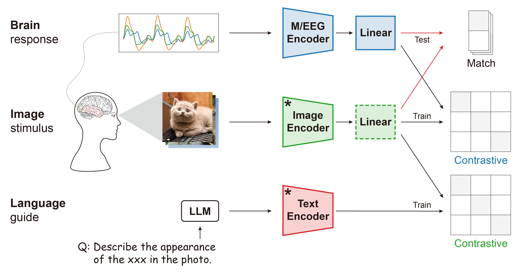

# NICE++
### Recognizing Natural Images from EEG with Language-Guided Contrastive Learning 

introduce language guide on the basis of [NICE](https://github.com/eeyhsong/NICE-EEG)
use text decriptions of the images or objects to refine the image features, further enhance the M/EEG representations.

updating ...

## Abstract

- Introduce a contrastive learning framework for EEG-based image recognition by aligning EEG and image representations, yielding remarkable zero-shot performance on extensive EEG datasets.
- Incorporate language guidance into the training stage to capture the core semantic information contained within EEG signals. The performance is significantly enhanced with the help of LLMs.
- Demonstrate the biological plausibility of decoding images from EEG through comparative experiments on EEG and MEG datasets, resolving temporal, spatial, spectral, and semantic aspects.

## Datasets
1. [Things-EEG2](https://www.sciencedirect.com/science/article/pii/S1053811922008758?via%3Dihub)
2. [Things-MEG](https://elifesciences.org/articles/82580) 
3. [Things-EEG1](https://www.nature.com/articles/s41597-021-01102-7)

## Pre-processing
### Script path
please refer to [NICE-preproessing](https://github.com/eeyhsong/NICE-EEG/tree/main/preprocessing)
  
## Get the Features from Pre-Trained Models
### Script path
- ./dnn_feature_extraction/
### Data Path (follow the original dataset setting)
- raw image: `./Data/Things-EEG2/Image_set/image_set/`
- preprocessed eeg data: `./Data/Things-EEG2/Preprocessed_data/`
- features of each images: `./Data/Things-EEG2/DNN_feature_maps/full_feature_maps/model/pretrained-True/`
- features been packaged: `./Data/Things-EEG2/DNN_feature_maps/pca_feature_maps/model/pretrained-True/`
- features of condition centers: `./Data/Things-EEG2/Image_set/`
### Steps
1. obtain feature maps with each pre-trained model with `obtain_feature_maps_xxx.py` (clip, vit, resnet...)
2. package all the feature maps into one .npy file with `feature_maps_xxx.py`
3. obtain feature maps of center images with `center_fea_xxx.py`
   - save feature maps of each center image into `center_all_image_xxx.npy`
   - save feature maps of each condition into `center_xxx.npy` (used in training)

## Training and testing
### Script path
- `./nicepp_eeg2.py` (primary)
- `./nicepp_eeg1.py`
- `./nicepp_meg.py`

## Visualization
please refer to [NICE-visualization](https://github.com/eeyhsong/NICE-EEG/tree/main/draw_pic)

## Citation
Hope this code is helpful. We would appreciate you citing us in your paper. 😊
```
@inproceedings{song2024decoding,
  title = {Decoding {{Natural Images}} from {{EEG}} for {{Object Recognition}}},
  author = {Song, Yonghao and Liu, Bingchuan and Li, Xiang and Shi, Nanlin and Wang, Yijun and Gao, Xiaorong},
  booktitle = {International {{Conference}} on {{Learning Representations}}},
  year = {2024},
}
```

